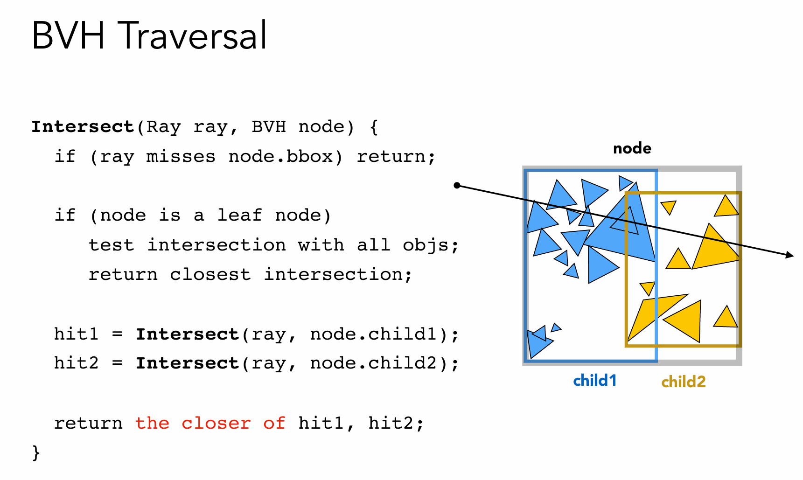

# Assignment 6 加速结构
## 编译
```bash
mkdir build
cd build
cmake ..
make
```

## 运行
```bash
./Raytracing
```

## 运行结果


## 学习笔记
- 在 `Triangle::getIntersection` 中，用 $t$ 来计算交点比用 重心坐标 计算**更快**
- 在 `Bounds3::IntersectP` 中，如果光线的x分量为负方向，则计算出来的 `txmin` 和 `txmax` 的大小会颠倒，所以要先交换后才能计算出正确结果
- `BVHAccel::getIntersection`的代码根据课程的伪代码写即可
