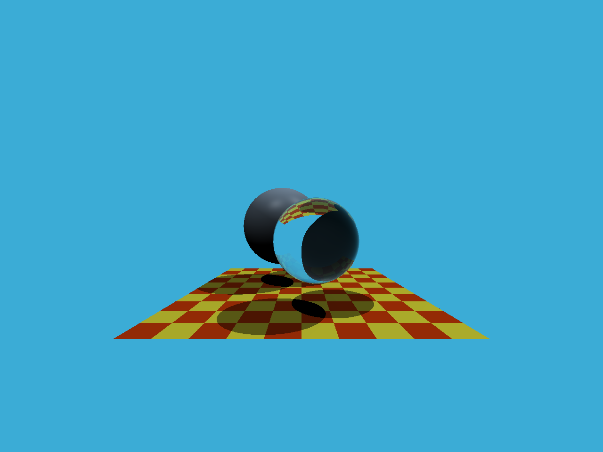
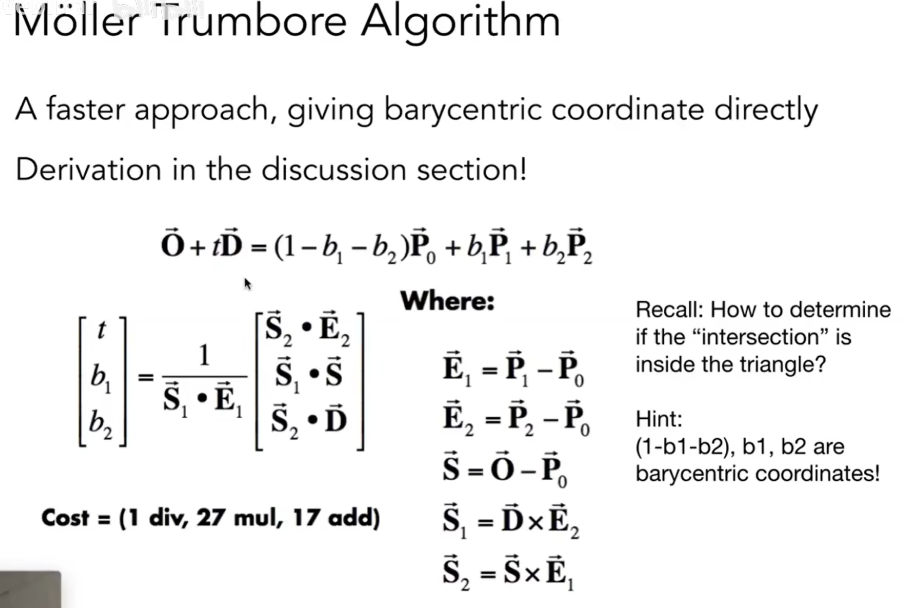

# Assignment 5 光线与三角形相交
## 编译
```bash
mkdir build
cd build
cmake ..
make
```

## 运行
```bash
./RayTracing
```

## 运行结果
### 光线生成


### 光线与三角形相交


## 学习笔记
- 在 `Render` 中
    - 先将获取像素中心点
    - 再将该中心点归一化 [0, 1]
    - 再转换到 **NDC** [-1, 1]
    - 再根据画面比例拉伸 $x$ 和 $y$，$x$ 乘以 `scale` 和 `imageAspectRatio`，$y$ 乘以 `scale` 
    - 注意 $y$ 的坐标是相反的
- 在 `rayTriangleIntersect` 中
    - 根据下列推导来计算即可
    