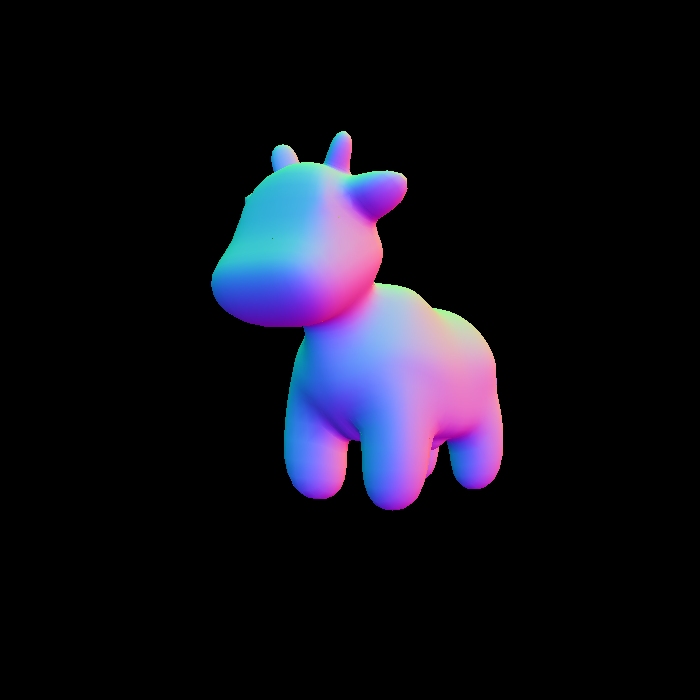
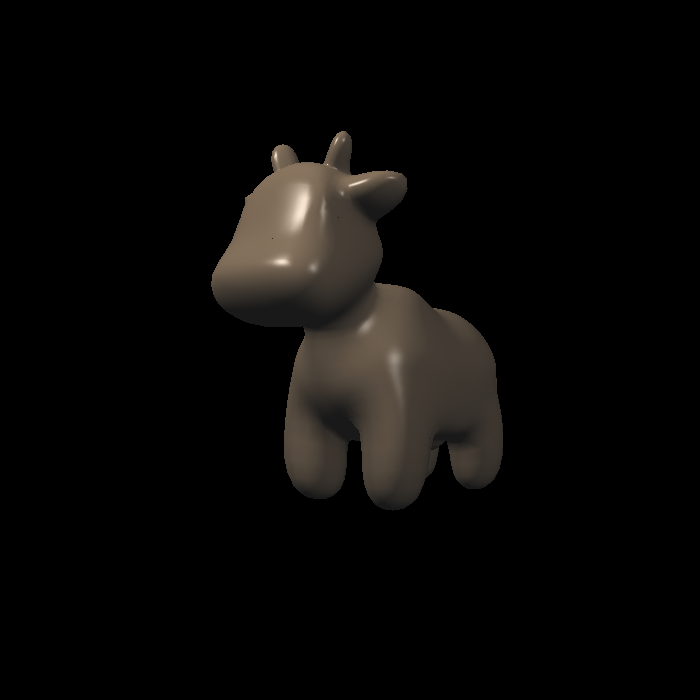
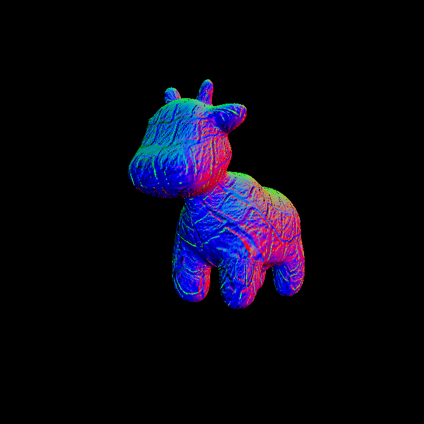
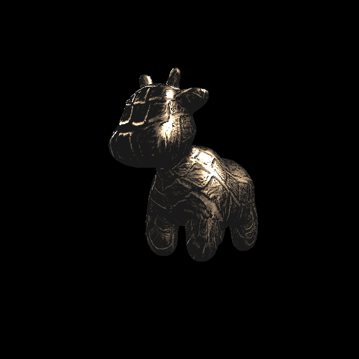
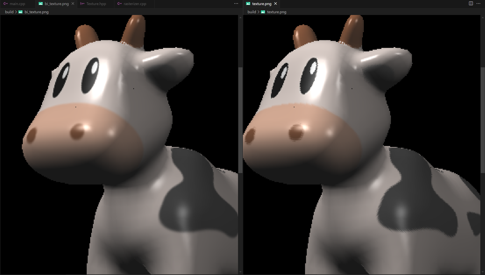

# Assignment 3 渲染管线和着色

## 编译
```bash
mkdir build
cd build
cmake ..
make
```

## 运行
```bash
./Rasterizer normal.png normal
./Rasterizer phong.png phong
./Rasterizer texture.png texture
./Rasterizer bump.png bump
./Rasterizer displacement.png displacement
./Rasterizer bi_texture.png texture # 需要先在 texture_fragment_shader 中关闭 getColorBilinear 的注释
```

## 运行结果
### Normal (法线贴图)

### Phong (Phong着色)

### Texture (纹理)

### Bump (凹凸贴图)

### Displacement (位移贴图)

### 双线性插值 & 对比



## 学习笔记
- 在 *rasterizer.cpp* 中， `rasterize_triangle` 与先前光栅化的不同在于，这次要把颜色传入到shader中进行处理，得到最终颜色
- 在 `phong_fragment_shader` 中
    - 对于三种属性的光，要 **按照每个分量** 来计算光强，**不能直接点乘**
    - 对于 **diffuse** 和 **specular**，光强还要先除以光源到目标点距离的平方，即 $r^2$，否则会渲染图会过曝
- 双线性插值的实现中，获取像素颜色要注意 **x和y** 的顺序
