# Assignment 7 路径追踪
## 编译
```bash
mkdir build
cd build
cmake ..
make
```
## 运行
```bash
./RayTracing
```
## 运行结果
### SPP = 4
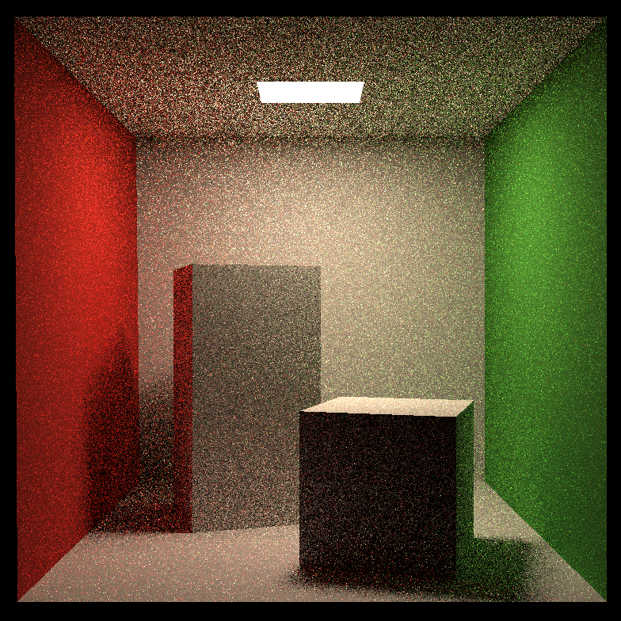
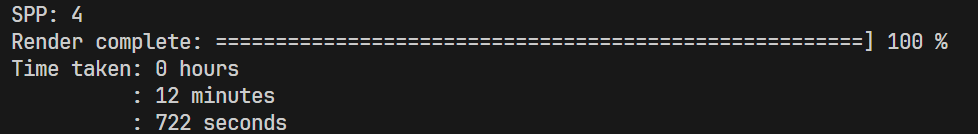

### SPP = 16

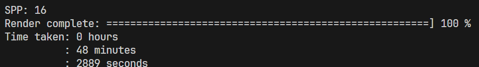

### SPP = 4（多线程）
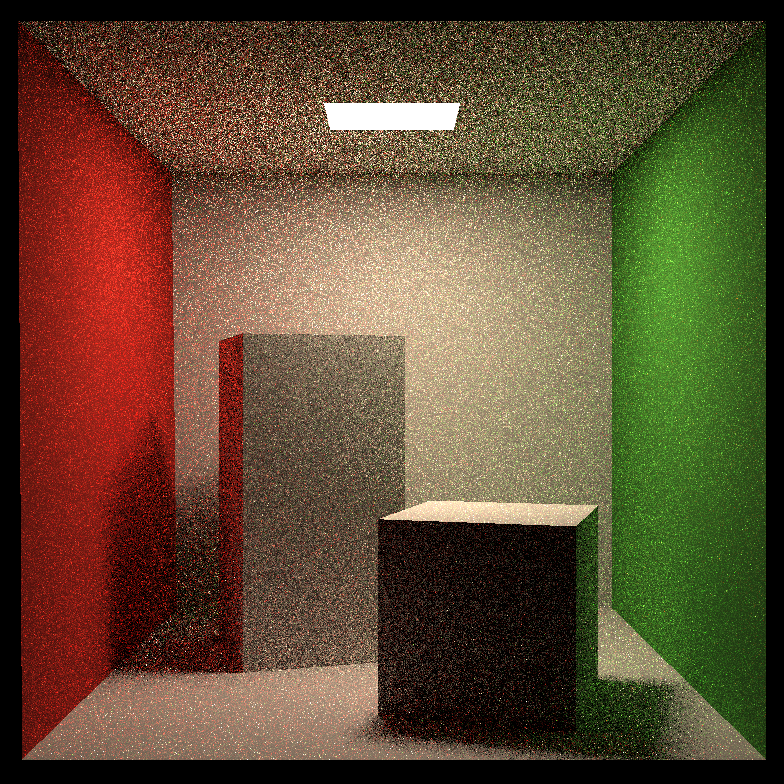
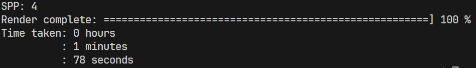

### SPP = 16（多线程）
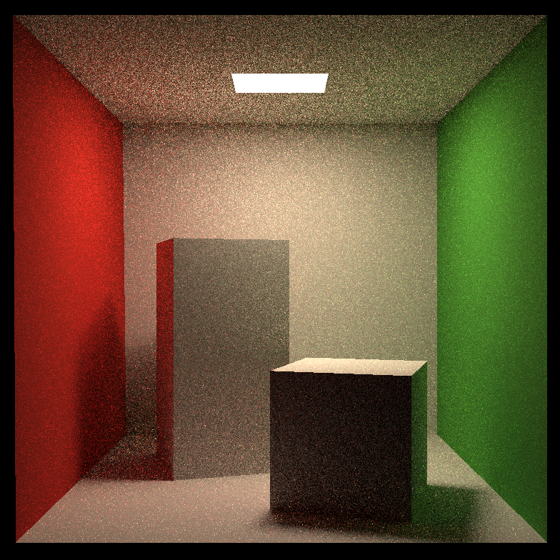
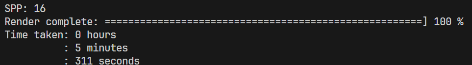

### SPP = 64（Microfacet sphere, left）
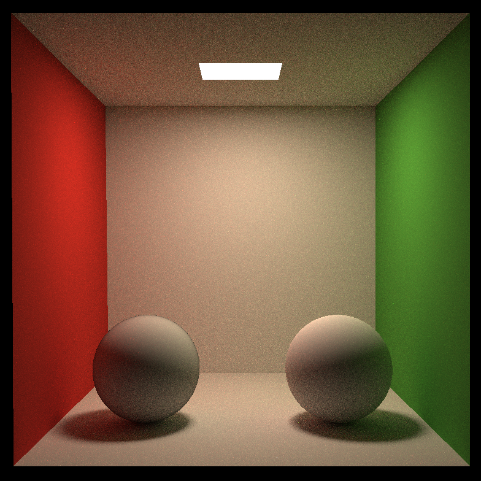

### SPP = 16（bunny diffuse）


### SPP = 16（bunny microfacet）


### SPP = 256（bunny microfacet）
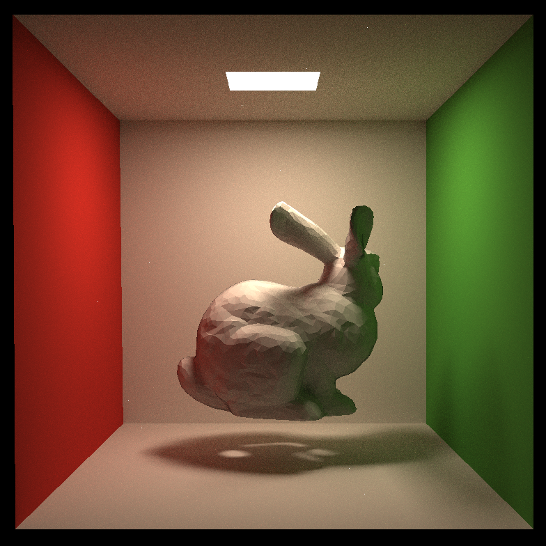
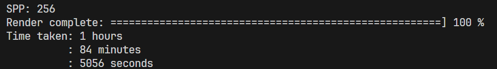

## 学习笔记
- 在 [Bounds3.hpp](Bounds3.hpp) 中，需要将判断条件 `if (t_exit > 0.0 && t_enter < t_exit)` 改为 `if (t_exit > 0.0 && t_enter <= t_exit)`，这里一定要判断相等的情况，不然渲染结果会出错！
- 在 [global.hpp](global.hpp) 中，将 `get_random_float()` 函数改为 `static`，能够加速随机数的生成
- 按以下伪代码实现路径追踪
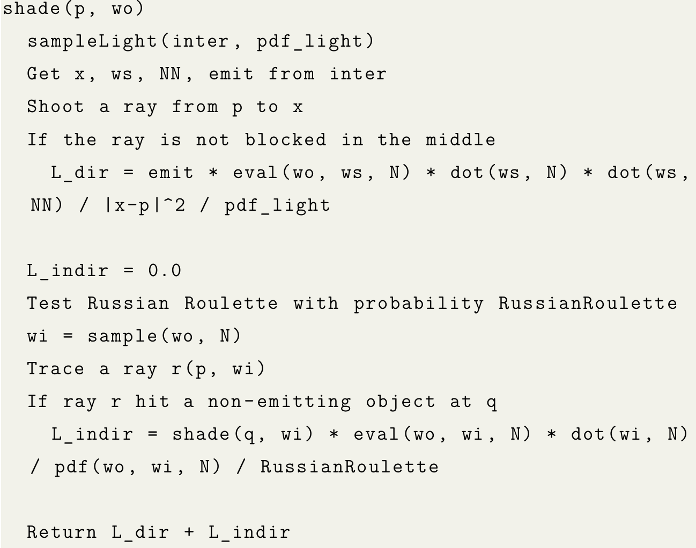
- 路径追踪图示</br>
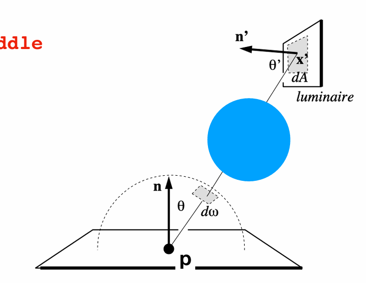
- 使用 `std::thread` 和 `std::mutex` 来实现多线程（[C++11 多线程（std::thread）详解](https://blog.csdn.net/sjc_0910/article/details/118861539)），自己写的多线程例子 [examples](Ref/Multi-thread.md)
- Microfacet的实现参考文章 [LearnOpenGL - Theory](https://learnopengl.com/PBR/Theory#:~:text=Normal%20distribution%20function%3A%20approximates,at%20different%20surface%20angles.)
    - 在 [Sphere.hpp](Sphere.hpp) 中，记得改一下光线与球相交的条件，避免因为浮点数精度问题出现黑点 (下图为 SPP = 4 的渲染图)
    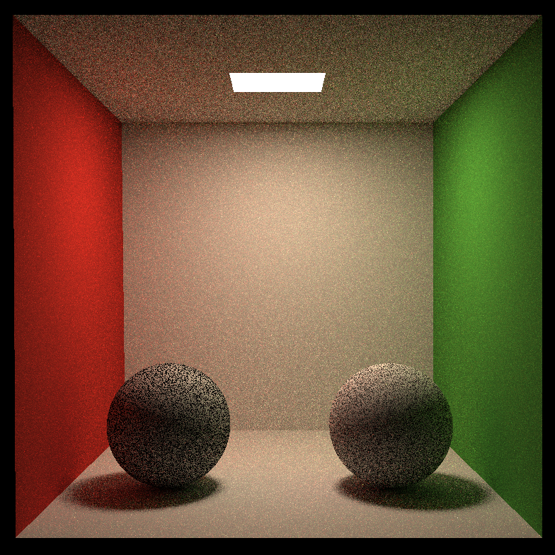
    - 记得在 [main.cpp](main.cpp) 中添加两个球体
    - 要显示 [bunny.obj](models/bunny/bunny.obj) 的话，需要在 [Triangle.hpp](Triangle.hpp) 的 `MeshTriangle` 类的构造函数中加上 **缩放** 和 **平移**，让模型出现在场景内